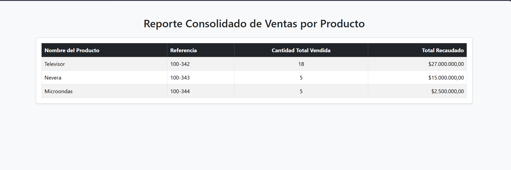

# Reporte de Ventas por Producto - Prueba Técnica Cari AI

Solución desarrollada para la prueba técnica de Ingeniería de Soporte / Backend en Cari AI. El proyecto implementa un reporte consolidado de ventas utilizando el framework **Laravel** bajo el patrón arquitectónico **MVC** y una interfaz limpia basada en **Bootstrap 5**.

## 📊 Vista Previa del Reporte



---

## 🛠️ Stack Tecnológico
* **Backend:** PHP 8.x, Laravel 11.
* **Base de Datos:** SQLite (configurada por defecto para facilitar la ejecución local sin dependencias de motores externos).
* **Frontend:** Bootstrap 5 (CDN), Blade Templates.

---

## 🚀 Instrucciones de Instalación y Despliegue

Para probar el proyecto localmente de forma rápida y limpia, siga estos pasos:

1. **Clonar el repositorio:**
   ```bash
   git clone https://github.com/YARE-CTRL/Prueba_Cari_PHP.git
   cd Prueba_Cari_PHP
   ```

2. **Instalar dependencias de PHP:**
   ```bash
   composer install
   ```

3. **Configurar el entorno:**
   Duplique el archivo de ejemplo para crear el entorno local:
   ```bash
   copy .env.example .env
   ```

4. **Genere la clave de la aplicación:**
   ```bash
   php artisan key:generate
   ```

5. **Configurar la Base de Datos (SQLite):**
   El proyecto está optimizado para usar SQLite. Asegúrese de que el archivo de base de datos vacía exista (Laravel lo crea automáticamente al migrar, o puede crearlo manualmente ejecutando `touch database/database.sqlite` en la terminal).

6. **Ejecutar Migraciones y Seeders:**
   Ejecute el siguiente comando para crear las tablas y poblar los datos de prueba del caso de estudio:
   ```bash
   php artisan migrate --seed
   ```

7. **Levantar el Servidor de Desarrollo:**
   ```bash
   php artisan serve
   ```

8. **Visualizar el Resultado:**
   Abra su navegador web e ingrese a: [http://127.0.0.1:8000](http://127.0.0.1:8000)
